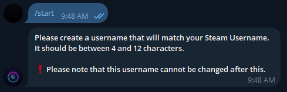

# How to Participate

1. Create a new Solana wallet on Phantom. Copy your new Solana wallet address.

2. Access Sol Royale Bot on Telegram.\
   [https://t.me/SolRoyaleBot](https://t.me/SolRoyaleBot)\
   Type /start command.\
   You will be asked to create a username (this will be associated with your Telegram account) and it should match your Steam username. This username must be between 4 and 12 characters long.\
   ❗️ Note: You will not be able to change this username after this. ❗️\

<figure><figcaption></figcaption></figure>

3. Join the Sol Royale Channel and Group.

<figure><figcaption></figcaption></figure>

4.  Access Sol Royale Bot on Telegram.\
    After selecting the "Attach Wallet Address" button, please paste your Solana wallet address here.\

    <figure><figcaption></figcaption></figure>

<figure><figcaption></figcaption></figure>

4. Transfer sufficient funds of SOL to your new Solana wallet.
5. Access Sol Royale Bot on Telegram.\
   Select the "Enter" button. Sol Royale Bot will assign you a "seat" where you will be given 2 minutes to pay the entry fee to be admitted into the new Pre-Game Lobby Group.\
   You must send payment from the SAME WALLET ADDRESS you attached to Sol Royale Bot, otherwise, the transaction cannot be verified.\
   Do not navigate away from this panel or type any commands when trying to make payment.\
   Make payment first, and once it has been confirmed, you may navigate away as you please.\
   If you take too long to pay, your seat will be revoked. Do not send payment if your seat has been revoked. You will have to select "Enter Again" to receive another seat and then send payment.\
   After sending payment, please allow up to 1 minute for the transaction to be verified.

<figure><figcaption></figcaption></figure>

<figure><figcaption></figcaption></figure>

6. Once your transaction has been verified, select the "Join Lobby" button to be added to the Pre-Game Lobby Group, which will contain other participants who have paid entry for the round. Participants who have not paid will be unable to join the Pre-Game Lobby Group.
7. The prize from being the winner in a round is equal to the pot prize pool (equal to the accumulation of all entry fees paid by participants) minus the service fees per player.
